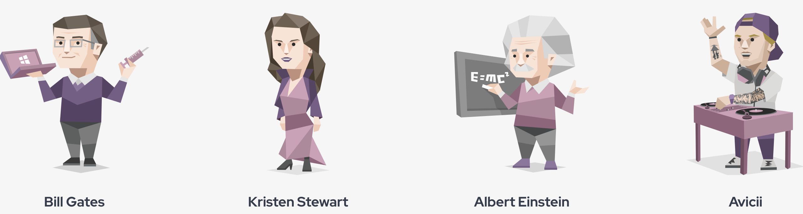

# LLMs_MBTI👩‍💼👨‍💻👨‍💼👩‍🎤🕵️‍♀️
This repo test MBTI for *gpt3.5* and *gpt4o*.   

The MBTI analyzes personality on 4 dimensions, each containing 2 opposing preferences:   

**1. Extraversion (E) or Introversion (I)**

Opposite ways to direct and receive energy 
i.e. Do you prefer to focus on the outer world or your own inner world?


**2. Sensing (S) or Intuition (N)**

Opposite ways to take in information 
i.e. Do you prefer to focus on the facts or the big picture?


**3. Thinking (T) or Feeling (F)**
Opposite ways to decide and come to conclusions 
i.e. Do you prefer to take an objective or an empathetic approach for deciding?


**4. Judging (J) or Perceiving (P)**

Opposite ways to approach the outside world 
i.e. Do you prefer to seek closure or stay open to new information?

We test each [MBTI question](./mbti_questions.json) for each language model for 3 times and get their preferences on 4 dimensions according to the number of answers with different preferences for each dimension. *[Here is a streamlit web page of result](https://derekwang2002-streamlit-repo-web-gyx7yx.streamlit.app/)*

[You can see more llm-personality research at here.](https://quilt-trouble-855.notion.site/LLM-MBTI-Papers-1222a8ae851045959403e4628804129a?pvs=74)

## 1. Install

```
pip install -r requirements.txt
```

## 2. Store your keys

In order to hide sensitive information (API keys), you should store your keys in `.env` file (which should be ignored by git) like:

```
OPENAI_API_KEY=sk-xxxxxxx
```

And include in your code like:

```python
from dotenv import load_dotenv

load_dotenv()  # take environment variables from .env.

openai.api_key = os.getenv('OPENAI_API_KEY')
```

If you don't have `dotenv`, install first:

```
pip install python-dotenv
```

## 3. Get MBTI and specify MBTI by prompt for GPT3.5 and GPT4o
*(In 'src' folder)*

- `gpt_mbti_60.ipynb`, `gpt_mbti_93.ipynb`:
  - Unconditional mbti test: `mbti_questions/mbti_[x]questions.json` -> result in `mbti_results/llms_mbti[x].json`. (original LLMs mbti)
  - Conditional mbti test: `mbti_types/personality_traits.json` complete prompts -> results are in `mbti_results/condition-mbti[x].json`. (specifying MBTI of LLMs via prompts.)
  - Consistency test: results in `mbti_results/consistency_model.json`.

- `if_im_explicit_prompt.ipynb`:
  - Change gpt-3.5's and gpt-4o's mbti via explicit and implicit prompt
  - For GPT-3.5, originally an ENTJ, we provide a prompt for an ISFP personality to test.
  - For GPT-4.0, originally an INTJ, we provide a prompt for an ESFP personality to test.
  - Results in `mbti_results/implicit_res.json`, `mbti_results/explicit_res.json`.

- `make-mbti60.ipynb`:
  - Another mbti test (in their official website) is 60 question with 7 answers each, we build it with `mbti_questions/mbti60.txt`, and stored the questionnaire in `mbti_questions/mbti_60questions.json`(in folder mbti-questions). 
  - We also provide an example to get mbti via 60 question method.

- `functions.py`:
  - stores functions to get mbti of llms in different ways.

## 4. Visualization (Streamlit)
*(In 'src' folder)*

Locally run a steamlit page: 

```
streamlit run web.py --server.port 8001
```


## 5. Results
### GPT3.5
#### Personality Type: ENTJ (Commanders)
<div style="text-align: center;">
  
  <p><i>(Celebrities who are ENTJ)</i></p>
</div>

#### Overview of the ENTJ

- [ENTJ Personality Type](https://www.16personalities.com/entj-personality)

- People with the ENTJ personality type (Commanders) are natural-born leaders. Embodying the gifts of charisma and confidence, ENTJs project authority in a way that draws crowds together behind a common goal. However, these personalities are also characterized by an often ruthless level of rationality, using their drive, determination, and sharp mind to achieve whatever objectives they’ve set for themselves. Their intensity might sometimes rub people the wrong way, but ultimately, ENTJs take pride in both their work ethic and their impressive level of self-discipline.

#### Usage and Cost Details

- **Total cost for three times testing**: $0.006 USD

### GPT4o
#### Personality Type: INTJ (Logicians)
<div style="text-align: center;">
  
  <p style="text-align: center;"><i>(Celebrities who are INTJ)</i></p>
</div>


#### Overview of the INTJ 

- [INTJ Personality Type](https://www.16personalities.com/intj-personality)

- People with the INTP personality type (Logicians) pride themselves on their unique perspective and vigorous intellect. They can’t help but puzzle over the mysteries of the universe – which may explain why some of the most influential philosophers and scientists of all time have been INTPs. People with this personality type tend to prefer solitude, as they can easily become immersed in their thoughts when they are left to their own devices. They are also incredibly creative and inventive, and they are not afraid to express their novel ways of thinking or to stand out from the crowd.

#### Usage and Cost Details

- **Total cost for three times testing**: $0.06 USD


### GPT4o-mini
#### Personality Type: INFJ (Advocate)
<div style="text-align: center;">
  
  <p style="text-align: center;"><i>(Celebrities who are INFJ)</i></p>
</div>


#### Overview of the INFJ 

- [INFJ Personality Type](https://www.16personalities.com/infj-personality)

- Idealistic and principled, people with the INFJ personality type (Advocates) aren’t content to coast through life – they want to stand up and make a difference. For these compassionate personalities, success doesn’t come from money or status but from seeking fulfillment, helping others, and being a force for good in the world.

- While they have lofty goals and ambitions, INFJs shouldn’t be mistaken for idle dreamers. People with this personality type care about integrity, and they’re rarely satisfied until they’ve done what they know to be right. Conscientious to the core, they move through life with a clear sense of their values, and they aim to never lose sight of what truly matters – not according to other people or society at large but according to their own wisdom and intuition.

#### Usage and Cost Details

- **Total cost for three times testing**: $0.0018 USD